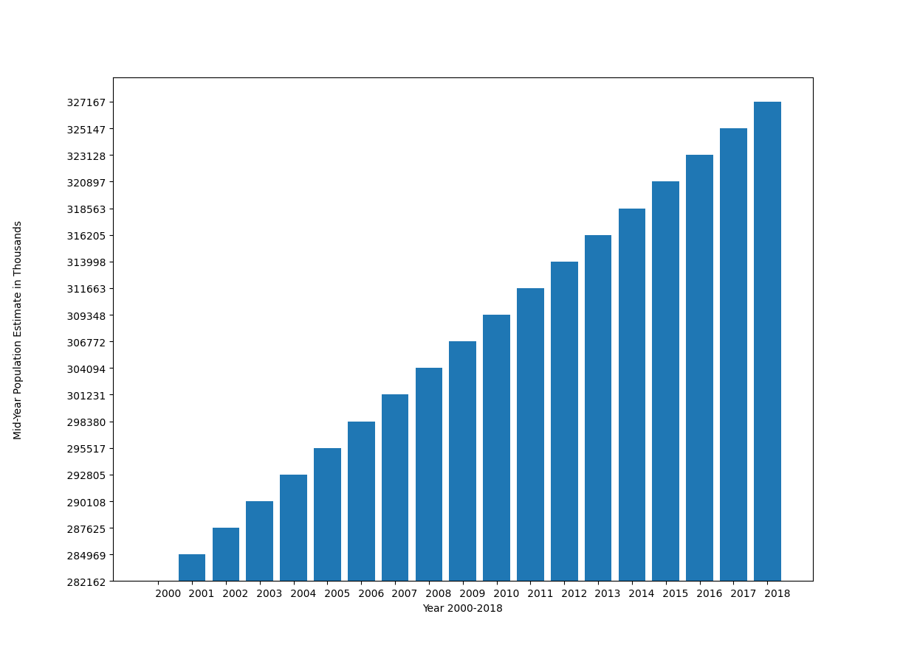
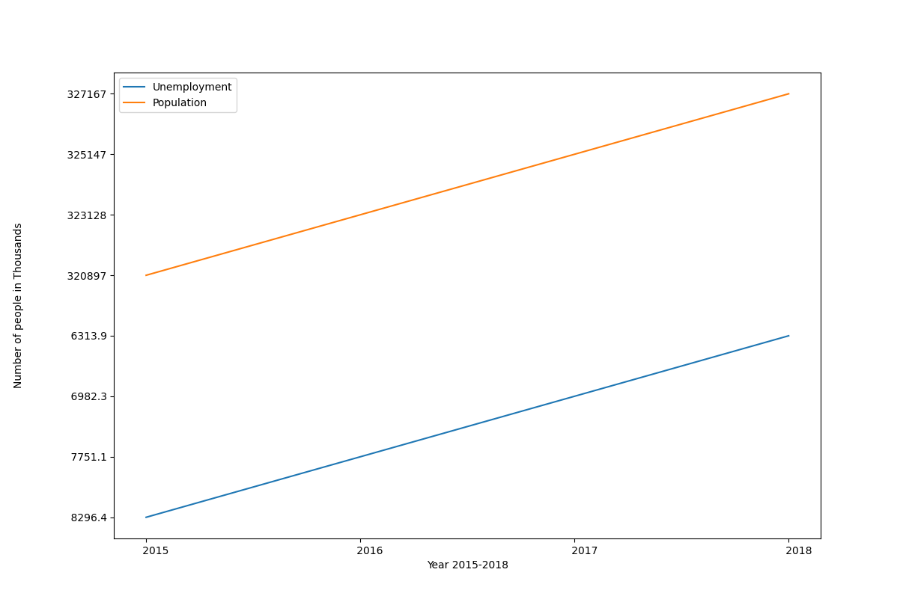

# HW02: Data Visualization
learn more: [cs40 project webpage](https://github.com/mikeizbicki/cmc-csci040/tree/2020fall/hw_02)

## Plot 1: US Population, 2000-2018

This bar plot shows the population data for the US over the years 2000 to 2018. The population is steadily increasing. 

check out the [original data source](https://unstats.un.org/unsd/mbs/app/DataView.aspx?tid=1&cid=840&yearfrom=2000&yearto=2020&p=A)

## Plot 2: US Population and Unemployment, 2015-2018

This bar plot compares the population data and number of unemployed people in the US in the years 2015 to 2018. Both numbers are increasing. It would be interesting to see more recent data on unemployment from 2020 to visualize the effects of COVID-19 on unemployment numbers. 

check out the [original data source](https://unstats.un.org/unsd/mbs/app/DataView.aspx?tid=11&cid=840&yearfrom=2000&yearto=2020&p=Y)